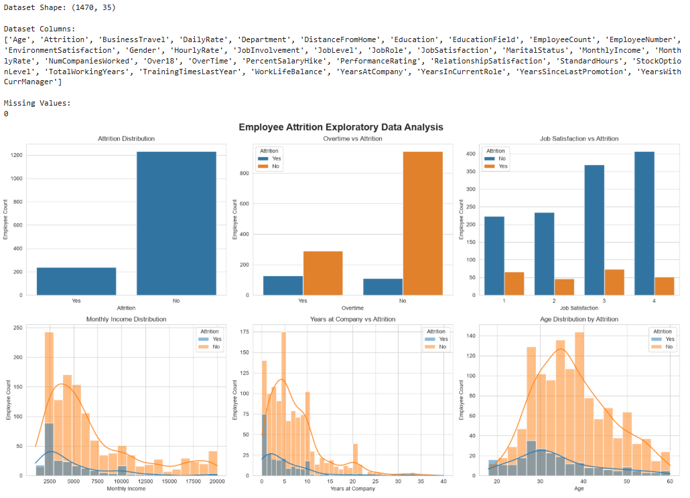
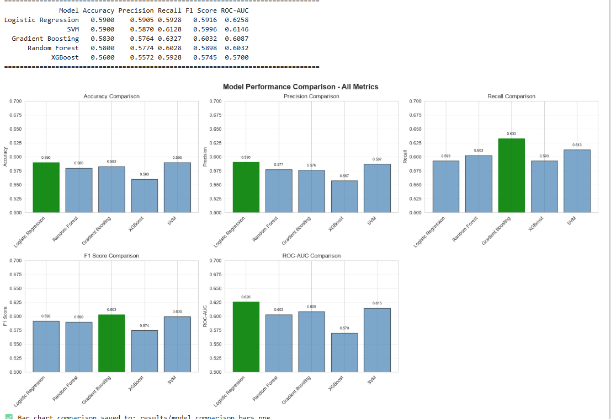
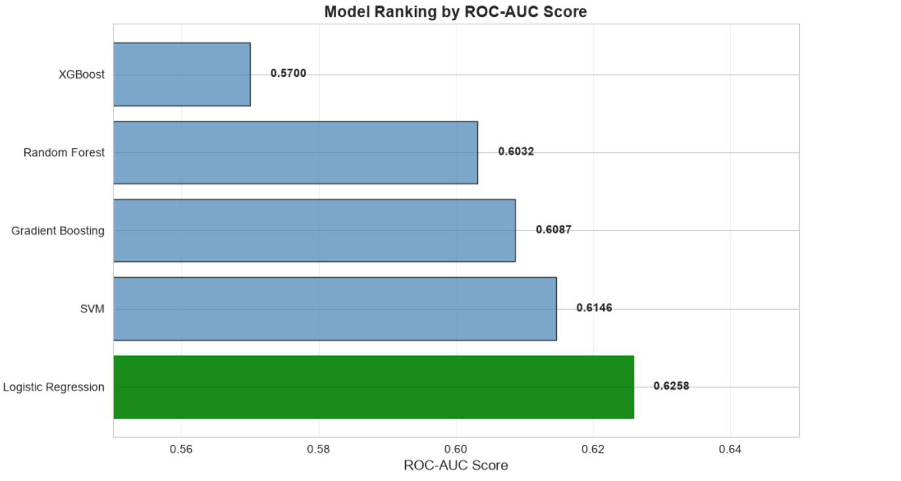
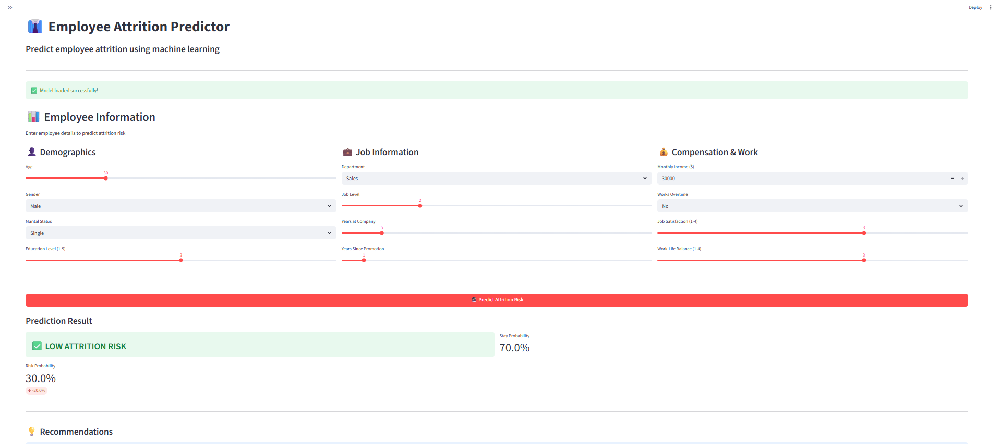

# Employee Attrition Prediction System

A machine learning system to predict employee attrition and identify key factors influencing employee turnover.

## 📋 Project Overview

This project uses machine learning algorithms to predict whether an employee is likely to leave the company based on various features such as job satisfaction, work-life balance, compensation, and career progression.

## 🎯 Objectives

- Predict employee attrition using machine learning 
- Identify key factors contributing to employee turnover
- Provide actionable insights for HR departments
- Create an interactive web application for real-time predictions

## 📊 Dataset

- **Source**: Synthetic data generated using realistic patterns (calibrated so that outcomes match published HR benchmarks)
- **Size**: 5,000 employee records
- **Features**: 28 features including demographics, job information, satisfaction scores, and compensation
- **Target**: Binary attrition (0 = Stayed, 1 = Left)
- **Attrition rate**: ~16% (matches the real-world IBM HR Analytics Attrition benchmark; this dataset previously generated an unrealistic ~50% attrition rate, which has since been fixed by calibrating the generator's probability model)

### Key Features:
- **Demographics**: Age, Gender, Marital Status, Education
- **Job Information**: Department, Role, Level, Years at Company
- **Compensation**: Monthly Income, Stock Options, Salary Hike
- **Work Environment**: Satisfaction scores, Work-Life Balance, Overtime
- **Performance**: Performance Rating, Training Times

## 🚀 Project Structure

```
employee-attrition-prediction/
│
├── data/
│   ├── raw/                    # Raw generated data
│   └── processed/              # Processed data ready for modeling
│
├── src/
│   ├── generate_data.py        # Data generation script
│   ├── preprocess.py           # Data preprocessing pipeline
│   ├── train_model.py          # Model training script
│   └── evaluate_model.py       # Model evaluation script
│
├── notebooks/
│   ├── EDA.ipynb              # Exploratory Data Analysis
│   └── model_comparison.ipynb  # Model comparison and selection
│
├── models/                     # Saved trained models
│
├── app/
│   └── main.py                # Streamlit web application
│
├── requirements.txt            # Project dependencies
└── README.md                  # Project documentation
```

## 🛠️ Installation

### Prerequisites
- Python 3.8 or higher
- pip package manager

### Setup Instructions

1. **Clone or navigate to the project directory**
```bash
cd employee-attrition-prediction
```

2. **Create a virtual environment (recommended)**
```bash
python -m venv venv
venv\Scripts\activate
```

3. **Install dependencies**
```bash
pip install -r requirements.txt
```

## 📖 Usage Guide

### 1. Generate Data
```bash
python src/generate_data.py --samples 5000
```

### 2. Preprocess Data
```bash
python src/preprocess.py
```

### 3. Train Models
```bash
python src/train_model.py
```

### 4. Evaluate Models
```bash
python src/evaluate_model.py
```

### 5. Run Web Application
```bash
streamlit run app/app.py
```

## 📈 Model Performance

The project compares multiple machine learning models:

- Logistic Regression (baseline)
- Random Forest Classifier
- Gradient Boosting (XGBoost)
- Support Vector Machine

Performance metrics:
- Accuracy
- Precision
- Recall
- F1-Score
- ROC-AUC Score
- Confusion Matrix

### Results (test set, 1,000 held-out employees, realistic ~16% attrition rate)

| Model | Accuracy | Precision | Recall | F1-Score | ROC-AUC |
|---|---|---|---|---|---|
| **Logistic Regression** 🏆 | 0.684 | 0.280 | 0.619 | 0.385 | **0.734** |
| Random Forest | 0.840 | 0.500 | 0.131 | 0.208 | 0.724 |
| Gradient Boosting | 0.843 | 0.527 | 0.181 | 0.270 | 0.727 |
| XGBoost | 0.827 | 0.397 | 0.156 | 0.224 | 0.676 |
| SVM | 0.769 | 0.287 | 0.300 | 0.294 | 0.676 |

Logistic Regression was selected as the best model on ROC-AUC (0.734), since with a rare positive class (16% attrition), plain accuracy is misleading — a model that predicts "stays" for everyone would already score ~84% accuracy while catching zero leavers. Because HR teams care most about *catching people at risk of leaving*, recall on the "Left" class and ROC-AUC are the metrics that matter here, not raw accuracy. The tree-based models have higher accuracy but much lower recall at the default 0.5 threshold — for a real deployment, their decision threshold should be tuned downward to trade some precision for better recall.

## 🔍 Key Features Influencing Attrition

Based on the data generation logic, key factors include:
- Job Satisfaction
- Work-Life Balance
- Overtime Requirements
- Years Since Last Promotion
- Monthly Income
- Distance From Home
- Stock Options
- Business Travel Frequency

## 🌐 Web Application Features

- Upload employee data (CSV format)
- Real-time attrition prediction
- Feature importance visualization
- Individual employee risk assessment
- Batch prediction capability

## 📊 Technologies Used

- **Data Processing**: Pandas, NumPy
- **Machine Learning**: Scikit-learn, XGBoost, Imbalanced-learn
- **Visualization**: Matplotlib, Seaborn, Plotly
- **Explainability**: SHAP
- **Web Framework**: Streamlit
- **Development**: Jupyter Notebook


### Screenshots

### EDA



### Model Performance Comparison



### Final Model Ranking



### Streamlit Application




👤 Author

Kirtan Parmar

GitHub: @Kirtan0024 "# Employee Attrition Prediction System "
